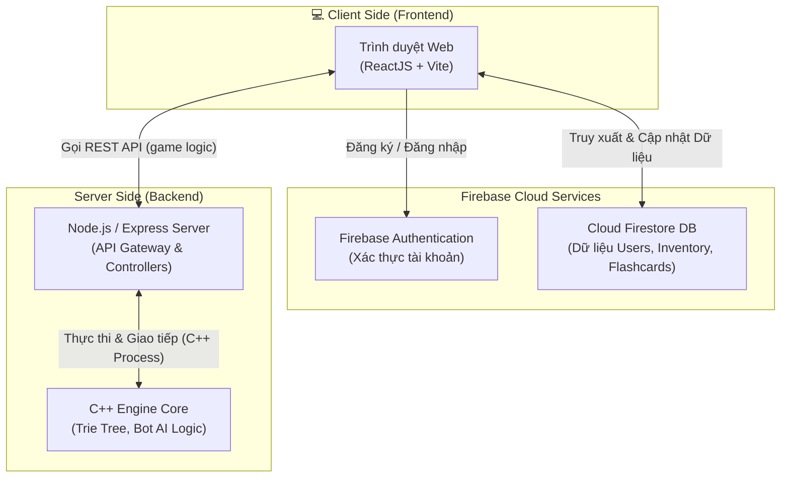

# Sơ đồ Kiến trúc Client-Server (VocabMaster)

Dưới đây là sơ đồ kiến trúc Client-Server tổng quan của dự án VocabMaster. Sơ đồ này mô tả cách luồng dữ liệu di chuyển giữa trình duyệt web của người dùng, Firebase (dịch vụ xác thực và lưu trữ cơ sở dữ liệu) và Backend Node.js kết hợp C++ Engine xử lý logic lõi của trò chơi.

## Sơ đồ Kiến trúc (Mermaid)

## Chú thích các thành phần chính:

1. **Client Side (ReactJS + Vite)**: 
   - Chịu trách nhiệm hiển thị giao diện, tiếp nhận tương tác nhập liệu của người dùng, render các hiệu ứng hình ảnh (animations, glassmorphism) và âm thanh.
   - Giao tiếp trực tiếp với Firebase để xử lý người dùng và lưu trữ dữ liệu, và gọi API Backend cho các thao tác cần xử lý AI.

2. **Firebase Cloud Services**:
   - **Authentication**: Quản lý vòng đời đăng ký, đăng nhập (email/mật khẩu, Google, v.v) an toàn.
   - **Cloud Firestore**: Database linh hoạt, lưu trữ thông tin về profile người chơi, số dư V-Coins, danh sách vật phẩm (Inventory) và các từ cần ôn tập (Flashcards).

3. **Server Side (Node.js/Express + C++ Engine)**:
   - **Express Server**: Cung cấp các endpoint REST API cho Client (ví dụ: `/api/game/play`, `/api/game/hint`). Nhận request, tiền xử lý và chuyển giao nhiệm vụ cho Engine C++.
   - **C++ Engine**: Hệ thống lõi chịu trách nhiệm tải cấu trúc dữ liệu Cây Trie (Trie Tree) để kiểm tra tính hợp lệ của từ. Nó cũng chứa AI Bot (dùng DFS/BFS) giúp tìm kiếm phản hồi nối từ nhanh nhất và thông minh nhất.
