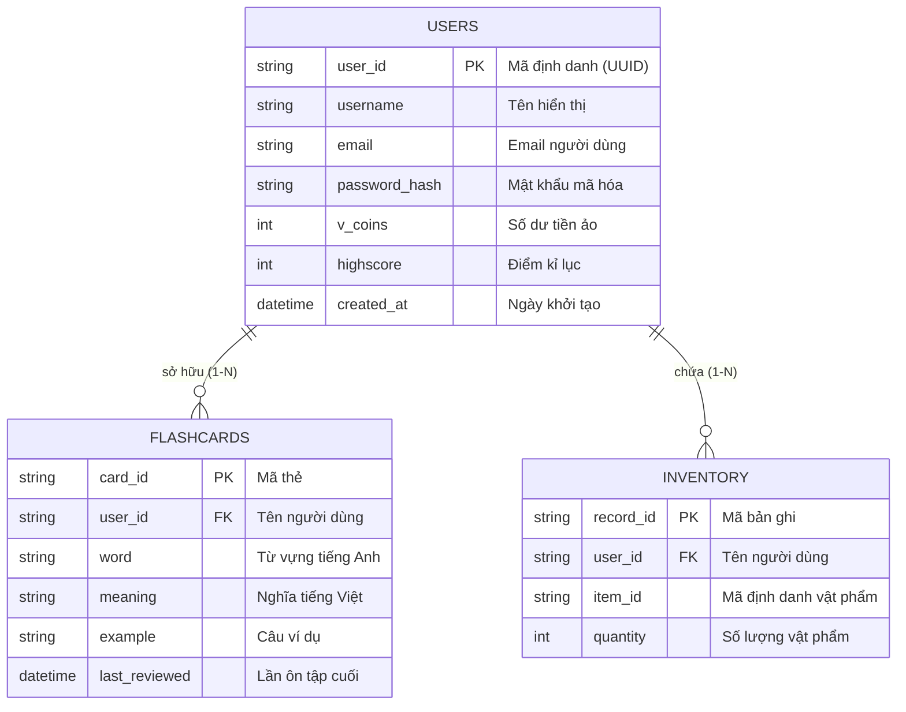

# Thiết kế Cơ sở dữ liệu (ERD & Data Specification)

Tài liệu này mô tả cấu trúc dữ liệu cho dự án VocabMaster, bao gồm Sơ đồ Thực thể - Mối liên kết (ERD) bằng Mermaid và đặc tả chi tiết các trường dữ liệu của 3 thực thể chính: `Users`, `Flashcards`, và `Inventory`.

## 1. Sơ đồ ERD (Entity-Relationship Diagram)

Dưới đây là sơ đồ thể hiện mối quan hệ logic giữa các tập dữ liệu (Collections/Tables). Mỗi người chơi (`USERS`) có thể sở hữu nhiều thẻ ôn tập (`FLASHCARDS`) và nhiều loại vật phẩm trong kho (`INVENTORY`).

---

## 2. Đặc tả Dữ liệu chi tiết (Data Specifications)

Mặc dù hệ thống thực tế sử dụng cơ sở dữ liệu dạng NoSQL (Firebase Firestore / MongoDB), chúng ta vẫn có thể đặc tả các trường theo tiêu chuẩn để dễ dàng kiểm soát luồng dữ liệu. Trong NoSQL, `Flashcards` và `Inventory` có thể là các *Sub-collections* nằm bên dưới mỗi *User Document*, hoặc là những *Collections* ngang hàng được trỏ (Reference) qua thuộc tính `user_id`.

### 2.1. Bảng / Collection `Users`
Lưu trữ thông tin hồ sơ của người chơi, thông tin xác thực và các chỉ số thành tích trong game.

| Tên trường (Field) | Kiểu dữ liệu (Type) | Ràng buộc (Constraints) | Mô tả (Description) |
| :--- | :--- | :--- | :--- |
| `user_id` | String | Primary Key, Unique, Not Null | ID duy nhất của người dùng (lấy từ Firebase Auth UUID hoặc MongoDB ObjectID). |
| `username` | String | Not Null | Tên hiển thị (Display Name) của người chơi. |
| `email` | String | Unique, Not Null | Địa chỉ email liên lạc và dùng để đăng nhập. |
| `password_hash` | String | | Hash mật khẩu (trong trường hợp tự build hệ thống Auth không dùng các Provider của Firebase). |
| `v_coins` | Integer | Default: 0 | Số tiền tệ trong game thu thập được qua các trận thắng. Dùng mua đồ. |
| `highscore` | Integer | Default: 0 | Điểm số kết hợp (Combo) cao nhất từng đạt được. |
| `created_at` | Timestamp | Not Null | Thời điểm tạo tài khoản. |

### 2.2. Bảng / Collection `Flashcards`
Danh sách các thẻ từ vựng. Khi người chơi bị Bot đánh bại, những từ khó hoặc từ bị sai sẽ tự động được thêm vào đây để ôn tập trong Thư viện Flashcard lật 3D.

| Tên trường (Field) | Kiểu dữ liệu (Type) | Ràng buộc (Constraints) | Mô tả (Description) |
| :--- | :--- | :--- | :--- |
| `card_id` | String | Primary Key, Unique, Not Null | Mã định danh duy nhất của thẻ từ. |
| `user_id` | String | Foreign Key, Not Null | Tham chiếu tới `user_id` của chủ sở hữu thẻ. |
| `word` | String | Not Null | Từ vựng tiếng Anh (Ví dụ: "apple"). |
| `meaning` | String | Not Null | Nghĩa tiếng Việt của từ (Ví dụ: "quả táo"). |
| `example` | String | | Câu ví dụ minh họa cách sử dụng trong ngữ cảnh. |
| `last_reviewed` | Timestamp | Nullable | Thời điểm người chơi mở thẻ này ra để ôn tập lần gần nhất. |

### 2.3. Bảng / Collection `Inventory`
Kho đồ của người chơi, nơi lưu trữ số lượng các vật phẩm trợ giúp (Boosters) đã mua được từ Cửa hàng (Shop).

| Tên trường (Field) | Kiểu dữ liệu (Type) | Ràng buộc (Constraints) | Mô tả (Description) |
| :--- | :--- | :--- | :--- |
| `record_id` | String | Primary Key, Unique, Not Null | Mã định danh bản ghi lưu trữ vật phẩm. |
| `user_id` | String | Foreign Key, Not Null | Tham chiếu tới `user_id` của chủ sở hữu. |
| `item_id` | String | Not Null | Tên mã của vật phẩm (Ví dụ: `hint_magnifier` - Kính lúp gợi ý, `extra_time` - Đồng hồ thêm giờ). |
| `quantity` | Integer | Default: 0, >= 0 | Số lượng vật phẩm hiện đang có. Mỗi khi dùng trong trận, số này bị trừ đi 1. |
